# Build Wget from Source

Wget is an utility for downloading of files non-interactively. 

That means that you can download files in the background.

The name comes from World Wide Web and get.

It was made by our neighbour Hrvoje Nikšić in 1996.

This guide illustrates how the program can be compiled from source. I've tried all this on Ubuntu 24.04.2 LTS on WSL.

This is for educational pursposes only. Ubuntu and many other distributions already come with it installed.

## Install build dependencies

```bash
sudo apt update
sudo apt install build-essential git autoconf automake libssl-dev \
    libidn2-0-dev libpsl-dev libgnutls28-dev pkg-config \
    gettext texinfo
```
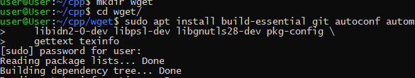


> - build-essential - compiler and tools
> - autoconf, automake, pkg-config - other build tools
> - libssl-dev, libgnutls28-dev - libs for https support
> - libidn2-0-dev, libpsl-dev - support for internation domain names and suffixes
> gettext, texinfo - docs and translations


## Clone repo

```bash
git clone https://github.com/mirror/wget.git
cd wget
```
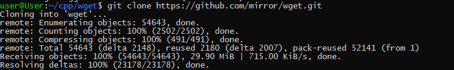


## Preparing build system
```bash
./bootstrap
```

>Bootstrap will probably fail

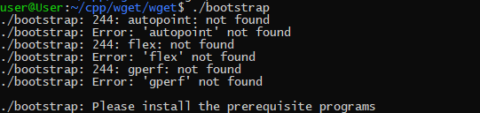

>Install required additional packages

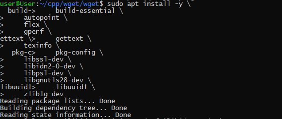

>This will run autoreconf and prepare configure file

>Also, a repo from savannag.gnu.rog will start to download
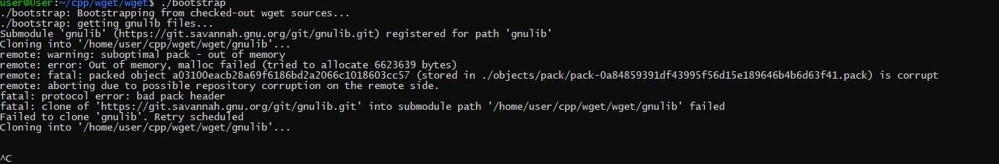

> But it's too big and takes a lot of time
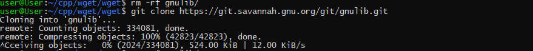

> So, let's take only a part of it, using --depth=1 option
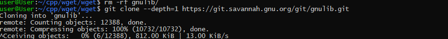

> Let's clone from other faster repo
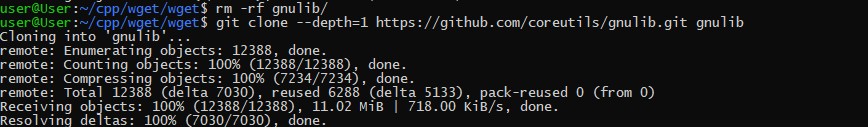

> Continue building
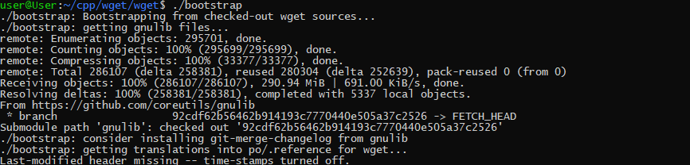

> Autoconf failed, so we need to install other packages
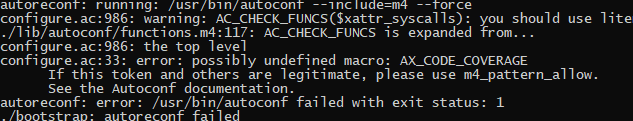

>Install additional packages
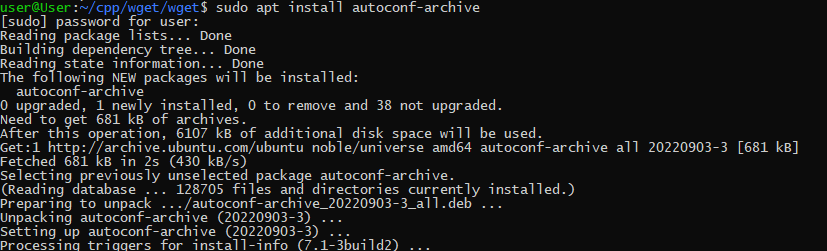

>Continue bootstrap
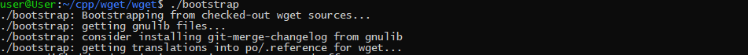

>Finished, now you can continue with ./configure
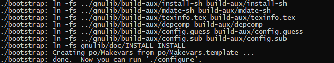


## Configure build
```bash
./configure --with-ssl=openssl
or 
./configure --with-ssl=gnutls
```
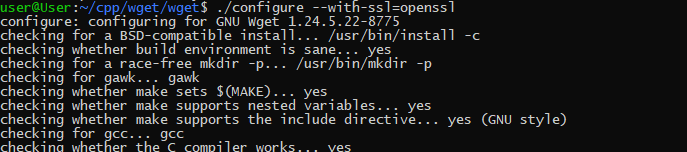


## Compile the code
```bash
make -j$(nproc)
```
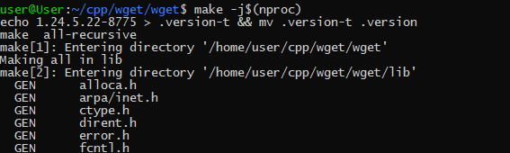

## List all files
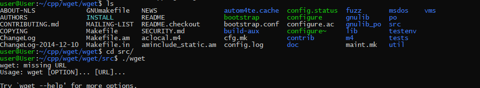
### Go to src directory
And see the compiled wget executable, marked as green
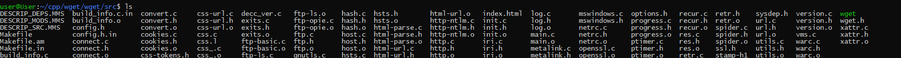

## Run the compiled wget
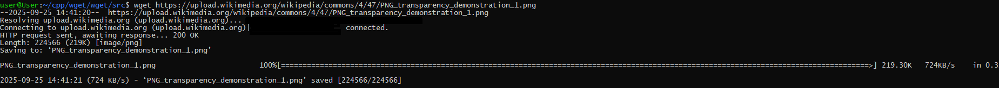

## Compare versions of the compiled and already installed wget
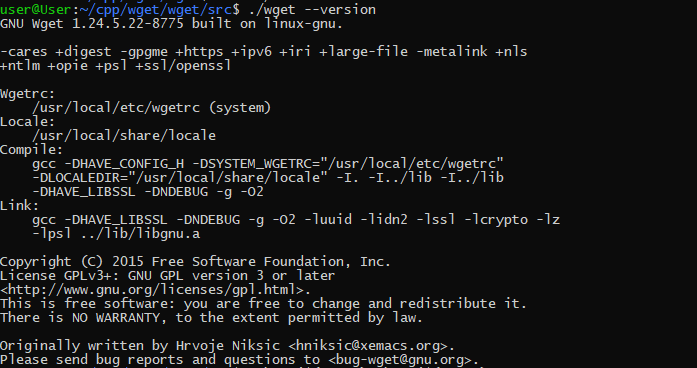
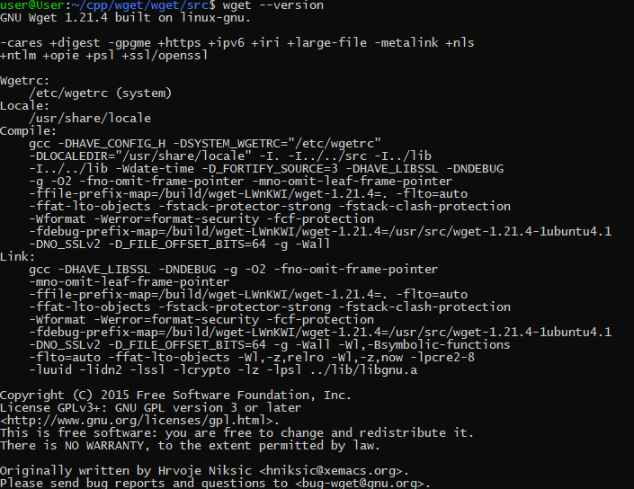


